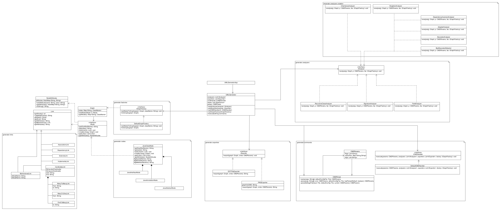
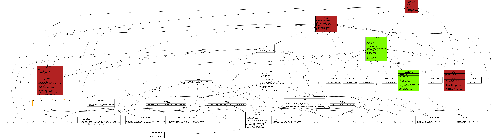

# UMLGenerator

*Project by Andrew McKee and Michael Trittin*

## UML Diagram

##### Project UML

##### Generated Project UML

## Design Philosophy

There are 4 main stages to the process, outlined below.

##### Stage 1:  Loading and Parsing

1. Parse command line arguments
2. Parse configuration file arguments
3. Load external classes *(if necessary)*

##### Stage 2: Building the Graph

1. Initialize the first pass `IAnalyzer` list
2. Initialize the lastpass `IAnalyzer` list
3. Initialize the `IExporter` list
4. Add nodes to the graph (based on command line arguments)

##### Stage 3: Analysis

1. Call `boolean analyze(Graph graph, CMDParams params, IGraphFactory factory)` on each `IAnalyzer` in the first pass list (in the order they were added)
2. Repeat step 1 until each `IAnalyzer` returns false
3. Call `boolean analyze(Graph graph, CMDParams params, IGraphFactory factory)` on each `IAnalyzer` in the lastpass list (in the order they were added)
4. Repeat step 3 until each `IAnalyzer` returns false

##### Stage 4: Exporting

1. Call `export(Graph graph, CMDParams params)` on each exporter (in the order they were added)

## Running the program

The program can be run with command line arguments to set certain paramters. Concrete IAnalyzers added to the system can also see these arguments, and make decisions based on that information. There are four types of arguments.

1. **Flags**: Single arguments that begin with a dash. They represent setting a toggleable boolean option. For example, if the `-f` argument is passed, then the system will recognize this as the `f` flag being set to `true`. The absense of such a flag is implies the flag should be set to `false`.
2. **Key-Value Pairs**: Key-Value pairs set a the value of a key in a map. The system will treat any argument that starts with two dashes as a key, and the next argument as the value. For example, `--maxnodes 5` would set the store `5` under `maxnodes` in the key-value pair map.
3. **Named lists**: A list of values that is stored under a name. This is a special type of argument, as only two named lists that are recognized are `whitelist` and `blacklist`. This is only set when using a `.xml` config properties file. Named lists maps an id `string` to a `List<String>`
4. **Arguments**: Generic arguments that do not fit any of the above categories. In our implementation of `ICMDHandler`, every argument is treated as class to include in the diagram.

### Command Line Arguments

These are the default command line arguments recognized by the `DefaultCMDHandler` implementation of `ICMDHandler`:

##### Flags
* `r`: Enable recursive mode (adds `RecursiveClassAnalyzer` to `IAnalyzer` list)
* `f`: Enable field analysis (adds `FieldAnalyzer` to `IAnalyzer` list)
* `s`: Enable signature analysis (adds `SignatureAnalyzer` to `IAnalyzer` list)
* `m`: Enable method-body analysis (adds `MethodBodyAnalyzer` to `IAnalyzer` list)
##### Key-Value Pairs
* `config`: Path to the configuration file to use for this runtime.
* `analyzers`: Comma seperated list of `IAnalyzer` implementations to add to the `IAnalyzer` list.
* `lastpass`: Comma seperated list of `IAnalyzer` implementations to add to the `lastpass` `IAnalyzer` list. The `lastpass` list is run after all the normal `IAnalyzer` list has finished.
* `ECI`: The location of the External Class Index XML
##### Named Lists
* `whitelist`: Whitelist of classes for the UML
* `blacklist`: Blacklist of classes for the UML

### Config File

The config file uses the [XML format for Java Properties](https://docs.oracle.com/javase/7/docs/api/java/util/Properties.html). Pairs can be specified with the pairs key, flags with the flags key, and options with the options key. Whitelist and blacklist also have their own key.

There is also a eci.xml that is used for loading classes off the class path. However, it is recommended that you use the java VM classpath argument instead wherever possible, as this behavior is not as consistent. 

### Implementation Details

* `BlacklistAnalyzer` and `LinkPriorityAnalyzer` are always added to last pass by default. In order to override this behavior, you will have to substitute out the `DefaultCMDHandler` with your own implementation of the `ICMDHandler`.
* `IGraphFactory` is a bit of a misnomer. `IGraphFactory` is more of a convenience/utility class than a factory, since the `Graph` can be modified fine without it. `IGraphFactory` just adds some convenience and syntax-safety in adding nodes and links. While it ostensibly is a factory for graphs, this definition is not as rigid as one might expect from more typical factory patterns. 
* The `ExternalClassLoader` does not actually support loading JARs in this version, despite what the code may suggest. Unfortunately we ran into errors in finding loaded classes from the URLClassLoader, so the functionality is disabled for the time being. However, the methods and such will remain in the implementation (despite non-functionality) in order to demonstrate future plans for the API. For the time being, it is best to unzip the jar to a folder, and then load that folder as a package using the package loading syntax in `eci.xml`.
* The `ExternalClassLoader` is not the optimal way of adding classes at runtime. It is much better to use the JVM's `classpath` or `cp` arguments wherever possible, as this adds it to the system ClassLoader, which is much less likely to experience bugs and corner cases. This option remains for situations. 